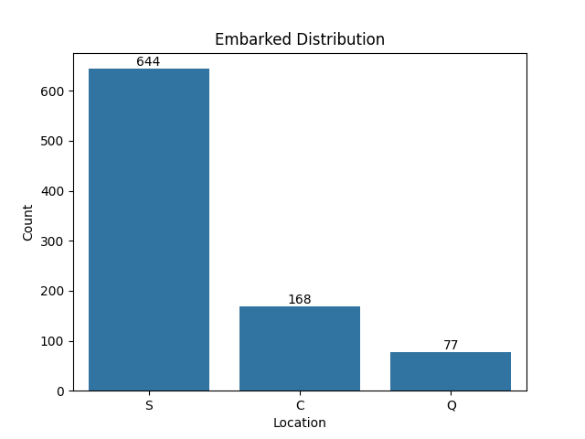
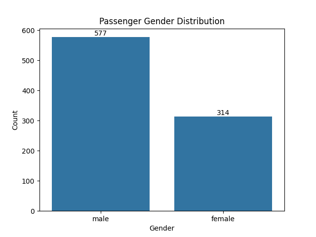
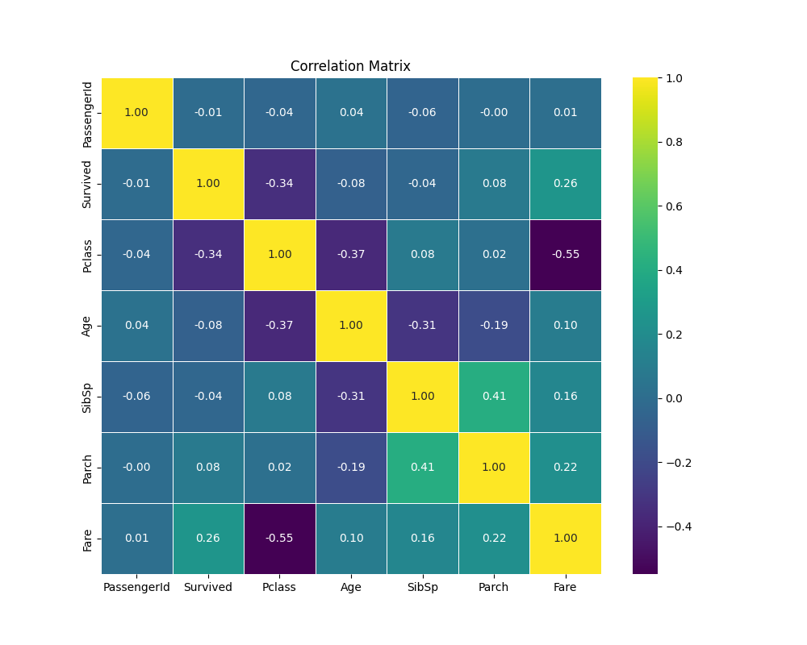
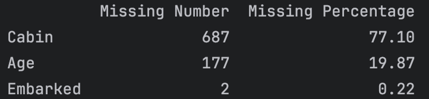
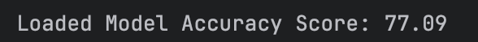
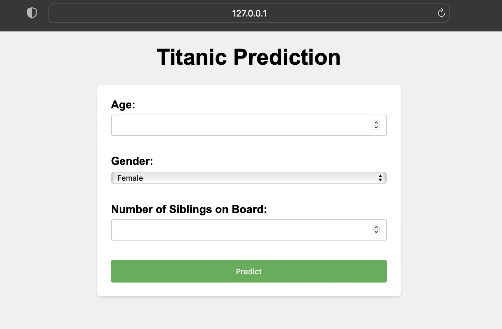
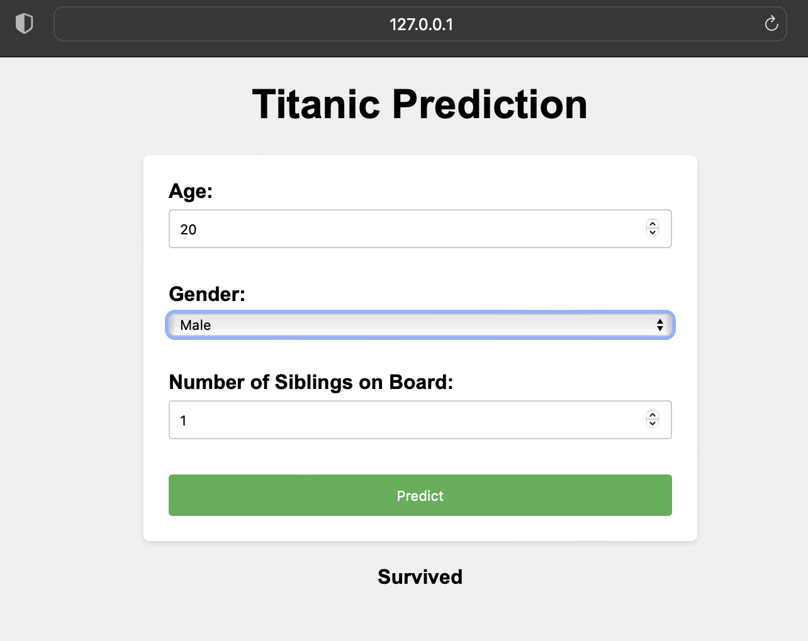

# Titanic Survival Prediction / A Web Application

Trained a RandomForestModel to predict if you would survive on the Titanic.
Takes age, gender, and # of siblings as input.

Kaggle Dataset: https://www.kaggle.com/c/titanic/data

I WILL UPDATE THIS PROJECT AS I WORK ON IT

###

## IMPORTS
```ruby
from flask import Flask, render_template, request
import pandas as pd
import pickle
import matplotlib.pyplot as plt
import seaborn as sns
from sklearn.model_selection import train_test_split
from sklearn.ensemble import RandomForestClassifier
from sklearn.preprocessing import StandardScaler
```

###

## Loading the data, lets take a look
```ruby
file_path = "/Users/tanaymarathe/PycharmProjects/titanic_learning_model/train.csv"
df = pd.read_csv(file_path)
print(df.head())

   PassengerId  Survived  Pclass  ...     Fare Cabin  Embarked
0            1         0       3  ...   7.2500   NaN         S
1            2         1       1  ...  71.2833   C85         C
2            3         1       3  ...   7.9250   NaN         S
3            4         1       1  ...  53.1000  C123         S
4            5         0       3  ...   8.0500   NaN         S
```

Off the bat, we many irrelevant columns

*** 

Lets visualize some of this data...

Distributions of passengers on the Titanic:




***
Viewing correlation of all the columns, so we know which are important:



*** 
### Data Cleaning

```ruby
def missing_value(df):
    missing_number = df.isnull().sum().sort_values(ascending=False)[df.isnull().sum().sort_values(ascending=False) != 0]
    missing_percent = round((df.isnull().sum() / df.isnull().count()) * 100, 2)[
        round((df.isnull().sum() / df.isnull().count()) * 100, 2) != 0]
    missing = pd.concat([missing_number, missing_percent], axis=1, keys=['Missing Number', 'Missing Percentage'])
    return missing

```



Handling the missing values:
```
df['Age'] = df['Age'].fillna(df['Age'].mean())  # mean age method
# df['Embarked'] = df['Embarked'].bfill()  # backwards fill method
df = df.drop(['Cabin', 'Name', 'Ticket', 'Cabin', 'PassengerId', 'Pclass', 'Parch', 'Fare', 'Embarked'],
             axis=1)  # drops columns we do not want to test
```

Converting catogorical gender data -> seperate columns (male/female)
```ruby
df = pd.get_dummies(df, columns=['Sex'])
```

### Building and Testing Random Forest Model

Splitting Test/Train Data
```ruby
X = df.drop(['Survived'], axis=1)
y = df['Survived']  # setting target variable

X_train, X_test, y_train, y_test = train_test_split(X, y, test_size=0.2, random_state=21)  # train test split
```
Normalizing Data
```ruby
scaler = StandardScaler()
X_train = scaler.fit_transform(X_train)
X_test = scaler.transform(X_test)
```
Training Model
```ruby
X_train = pd.DataFrame(X_train, columns=X.columns)
X_test = pd.DataFrame(X_test, columns=X.columns)

random_forest = RandomForestClassifier(n_estimators=100)
random_forest.fit(X_train, y_train)
```


```
Pickling Model 
```ruby
with open('random_forest_model.pkl', 'wb') as file:
    pickle.dump(random_forest, file)

# Load the trained model from the file
with open('random_forest_model.pkl', 'rb') as file:
    loaded_model = pickle.load(file)

# Use the loaded model for predictions
loaded_model_accuracy = loaded_model.score(X_test, y_test)
print("Loaded Model Accuracy Score:", round(loaded_model_accuracy * 100, 2))
```
Initializing Flask routes, deploying model on web 
```ruby
app = Flask(__name__)


# default page of our web-app
@app.route('/')
def home():
    return render_template('index.html')


# Prediction route
@app.route('/predict', methods=['POST'])
def predict():
    # Extract input features from the request form
    age = float(request.form['age'])
    siblings = int(request.form['siblings'])
    sex = request.form['sex']  # Assuming 'Gender' is a dropdown with 'Male' or 'Female'

    # Map sex to numerical values (0 for female, 1 for male)
    sex_mapping = {'Female': 0, 'Male': 1}
    sex_numeric = sex_mapping.get(sex)

    # Prepare the input features for prediction with column names
    input_features = pd.DataFrame([[age, 0, 0, siblings]], columns=['Age', 'SibSp', 'Sex_female', 'Sex_male'])

    if sex_numeric == 0:
        input_features['Sex_female'] = 1
    else:
        input_features['Sex_male'] = 1

    # Make prediction using the model
    prediction = loaded_model.predict(input_features)

    # Render prediction result in HTML template
    if prediction[0] == 1:
        result_text = 'Survived'
    else:
        result_text = 'Did not survive'
```
Extracting user input to HTML file
```ruby
    return render_template('index.html', prediction_text=result_text)

if __name__ == "__main__":
    app.run(debug=True)
```
### Lets see it run!\

***
Adding my own info as input...

I survived!
